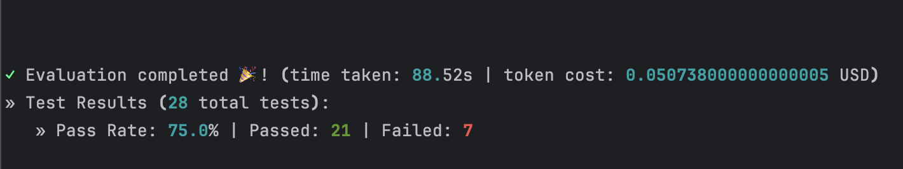

# DeepEval LLM Evaluation  — Bug Report Rewriter


## 📌 Overview

A DeepEval-based test suite evaluating an LLM system that rewrites vague, non-technical bug
reports — the kind submitted by customers or end users through support tickets — into a
properly structured format (title, steps to reproduce, expected/actual behavior, severity, priority).

Tests four DeepEval metrics: GEval (custom correctness criteria), Hallucination, Prompt Alignment,
and JSON Correctness.


## ✅ What it checks
- **GEval (LLM-as-a-judge, custom criteria)** — is the rewrite factually accurate?
- **Hallucination (LLM-as-a-judge, pre-built)** — did it invent details not in the original report?
- **Prompt Alignment (LLM-as-a-judge, pre-built)** — were the explicit formatting instructions followed?
- **JSON Correctness** — is the output valid JSON matching BugReportSchema?

## 🖼️ Workflow Screenshot




## 🔄 Workflow

1. `bug_report_rewriter.py` rewrites one vague customer report into a structured bug report
2. `test_bug_report_rewriter.py` runs each customer report through the rewriter and checks it four ways:
   - GEval (Custom Metric) — is the rewrite factually accurate?
   - Hallucination Metric — did it invent details not in the original report?
   - Prompt Alignment Metric — were the explicit formatting instructions followed?
   - JSON Correctness Metric — is the output valid JSON matching BugReportSchema?


## 📁 Project Structure

```
deepeval-llm-eval-bug-reports

├── bug_report_rewriter.py
├── customer_issues_test_data.py
├── test_bug_report_rewriter.py
├── workflow_screenshot.png
├── test_results_output.txt
├── .env
├── .gitignore
├── requirements.txt
└── README.md

```

## 🛠️ Tech stack
- Python
- Anthropic Claude API(via the `anthropic` Python SDK)
- python-dotenv
- deepeval
- pydantic


## ▶️ How to run it
1. Clone the repo
2. `pip install -r requirements.txt`
3. Add your API key to a `.env` file: `ANTHROPIC_API_KEY=your-key-here`
4. `deepeval test run test_bug_report_rewriter.py
`


## 📊 Sample output

```
                                                                                       Test Results                                                                                       
┏━━━━━━━━━━━━━━━━━━━━━━━━━━━━━━━━━━━━━━━━━━━━━━━━━━━━━━━━━━━━━━━━━┳━━━━━━━━━━━━━━━━━━━━━┳━━━━━━━━━━━━━━━━━━━━━━━━━━━━━━━━━━━━━━━━━━━━━━━━━━━━━━━━━━━━━━━━┳━━━━━━━━┳━━━━━━━━━━━━━━━━━━━━━━┓
┃ Test case                                                       ┃ Metric              ┃ Score                                                          ┃ Status ┃ Overall Success Rate ┃
┡━━━━━━━━━━━━━━━━━━━━━━━━━━━━━━━━━━━━━━━━━━━━━━━━━━━━━━━━━━━━━━━━━╇━━━━━━━━━━━━━━━━━━━━━╇━━━━━━━━━━━━━━━━━━━━━━━━━━━━━━━━━━━━━━━━━━━━━━━━━━━━━━━━━━━━━━━━╇━━━━━━━━╇━━━━━━━━━━━━━━━━━━━━━━┩                                                                  │                                                                 │                     │                                                                │        │                      │
│ test_correctness[The form is not submitting when selecting xyz  │                     │                                                                │        │ 100.0%               │
│ option(non mandatory field)]                                    │                     │                                                                │        │                      │
│                                                                 │ Correctness [GEval] │ 0.8 (threshold=0.5, evaluation model=claude-haiku-4-5-20251001 │ PASSED │                      │
│                                                                 │                     │ (Anthropic), reason=The Actual Output accurately extracts and  │        │                      │
│                                                                 │                     │ represents the key factual claims from the Input. The title,   │        │                      │
│                                                                 │                     │ summary, expected behavior, and actual behavior all correctly  │        │                      │
│                                                                 │                     │ reflect that the form fails to submit when the 'xyz' option is │        │                      │
│                                                                 │                     │ selected in a non-mandatory field. The output appropriately    │        │                      │
│                                                                 │                     │ identifies the missing reproduction steps and assigns          │        │                      │
│                                                                 │                     │ reasonable severity (Major) and priority (High) levels given   │        │                      │
│                                                                 │                     │ the blocking nature of the issue. The only minor limitation is │        │                      │
│                                                                 │                     │ that the output could have requested more specific details     │        │                      │
│                                                                 │                     │ about the field type, error messages, or browser/environment   │        │                      │
│                                                                 │                     │ context, but this does not constitute a factual inaccuracy.    │        │                      │
│                                                                 │                     │ All claims in the Actual Output are supported by or consistent │        │                      │
│                                                                 │                     │ with the Input provided., error=None)                          │        │                      │
│                                                                 │                     │                                                                │        │                      │
│ test_correctness[Even after successfully registering and paying │                     │                                                                │        │ 100.0%               │
│ the fee the syetem is not showing the confirmation page]        │                     │                                                                │        │                      │
│                                                                 │ Correctness [GEval] │ 0.9 (threshold=0.5, evaluation model=claude-haiku-4-5-20251001 │ PASSED │                      │
│                                                                 │                     │ (Anthropic), reason=The Actual Output accurately extracts and  │        │                      │
│                                                                 │                     │ represents all key factual claims from the Input. The title,   │        │                      │
│                                                                 │                     │ summary, steps to reproduce, expected behavior, and actual     │        │                      │
│                                                                 │                     │ behavior all directly correspond to the user's report that     │        │                      │
│                                                                 │                     │ 'the system is not showing the confirmation page' after        │        │                      │
│                                                                 │                     │ 'successfully registering and paying the fee.' The claims are  │        │                      │
│                                                                 │                     │ well-supported by the Input statement. Minor deduction is      │        │                      │
│                                                                 │                     │ applied because the Actual Output adds interpretive elements   │        │                      │
│                                                                 │                     │ (severity and priority classifications) that, while            │        │                      │
│                                                                 │                     │ reasonable, are not explicitly stated in the Input and         │        │                      │
│                                                                 │                     │ therefore represent minor inference beyond strict factual      │        │                      │
│                                                                 │                     │ extraction., error=None)                                       │        │                      │
│                                                                 │                     │                                                                │        │                      │ 
│ test_hallucination[The form is not submitting when selecting    │                     │                                                                │        │ 100.0%               │
│ xyz option(non mandatory field)]                                │                     │                                                                │        │                      │
│                                                                 │ Hallucination       │ 0.0 (threshold=0.5, evaluation model=claude-haiku-4-5-20251001 │ PASSED │                      │
│                                                                 │                     │ (Anthropic), reason=The score is 0.00 because the actual       │        │                      │
│                                                                 │                     │ output fully aligns with the provided context regarding the    │        │                      │
│                                                                 │                     │ form submission issue with the xyz option. No contradictions   │        │                      │
│                                                                 │                     │ were identified, and the additional structured details         │        │                      │
│                                                                 │                     │ provided (title, summary, steps, expected/actual behavior,     │        │                      │
│                                                                 │                     │ severity, priority) enhance clarity without introducing any    │        │                      │
│                                                                 │                     │ factual inaccuracies., error=None)                             │        │                      │
│                                                                 │                     │                                                                │        │                      │
│ test_hallucination[Even after successfully registering and      │                     │                                                                │        │ 100.0%               │
│ paying the fee the syetem is not showing the confirmation page] │                     │                                                                │        │                      │
│                                                                 │ Hallucination       │ 0.0 (threshold=0.5, evaluation model=claude-haiku-4-5-20251001 │ PASSED │                      │
│                                                                 │                     │ (Anthropic), reason=The score is 0.00 because the actual       │        │                      │
│                                                                 │                     │ output perfectly aligns with the provided context with no      │        │                      │
│                                                                 │                     │ contradictions detected. Both sources consistently describe    │        │                      │
│                                                                 │                     │ the same scenario: successful user registration and payment    │        │                      │
│                                                                 │                     │ completion followed by a system failure to display the         │        │                      │
│                                                                 │                     │ confirmation page., error=None)                                │        │                      │
│ test_prompt_alignment[Even after successfully registering and   │                     │                                                                │        │ 100.0%               │
│ paying the fee the syetem is not showing the confirmation page] │                     │                                                                │        │                      │
│                                                                 │ Prompt Alignment    │ 0.67 (threshold=0.5, evaluation                                │ PASSED │                      │
│                                                                 │                     │ model=claude-haiku-4-5-20251001 (Anthropic), reason=The score  │        │                      │
│                                                                 │                     │ is 0.67 because while the LLM successfully structured the bug  │        │                      │
│                                                                 │                     │ report and accurately captured the core issue from the input,  │        │                      │
│                                                                 │                     │ it violated the instruction to avoid inferring information not │        │                      │
│                                                                 │                     │ explicitly provided. Specifically, the 'severity' and          │        │                      │
│                                                                 │                     │ 'priority' fields were assigned definitive values ('Major' and │        │                      │
│                                                                 │                     │ 'High') when these details were not mentioned in the           │        │                      │
│                                                                 │                     │ input—they should have been marked as 'Not specified — needs   │        │                      │
│                                                                 │                     │ clarification' instead. This represents a clear deviation from │        │                      │
│                                                                 │                     │ the stated rules about handling ambiguous or missing           │        │                      │
│                                                                 │                     │ information., error=None)                                      │        │                      │
│                                                                 │                     │                                                                │        │                      │
│                                                                 │                     │                                                                │        │                      │
│ test_json_correctness[Even after successfully registering and   │                     │                                                                │        │ 0.0%                 │
│ paying the fee the syetem is not showing the confirmation page] │                     │                                                                │        │                      │
│                                                                 │ Json Correctness    │ 0.0 (threshold=0.5, evaluation model=claude-haiku-4-5-20251001 │ FAILED │                      │
│                                                                 │                     │ (Anthropic), reason=The generated Json is not a valid JSON     │        │                      │
│                                                                 │                     │ because while all required fields ('title', 'summary',         │        │                      │
│                                                                 │                     │ 'steps_to_reproduce', 'expected', 'actual', 'severity',        │        │                      │
│                                                                 │                     │ 'priority') are present with correct data types matching the   │        │                      │
│                                                                 │                     │ Expected Json Schema, the schema validation fails due to       │        │                      │
│                                                                 │                     │ missing or invalid enum constraints on the 'severity' and      │        │                      │
│                                                                 │                     │ 'priority' fields that are likely defined in the complete      │        │                      │
│                                                                 │                     │ schema definition not shown here., error=None)                 │        │                      │
│                                                                 │                     │                                                                │        │                      │
│ Note: Use Confident AI with DeepEval to analyze failed test     │                     │                                                                │        │                      │
│ cases for more details                                          │                     │                                                                │        │                      │
└─────────────────────────────────────────────────────────────────┴─────────────────────┴────────────────────────────────────────────────────────────────┴────────┴──────────────────────┘
             
```

## ⚠️ Known Limitations

- The **JSON Correctness** metric fails all 7 reports for the same reason: it doesn't like
  the placeholder text ("Not specified — needs clarification"), even though it usually admits
  the JSON itself is structurally valid. This seems to be the metric judging content quality,
  not just structure — which goes beyond what it's supposed to check. The other three metrics
  (Correctness, Hallucination, Prompt Alignment) passed consistently across all 7 reports.


## 👩‍💻 Author
Swati J 
